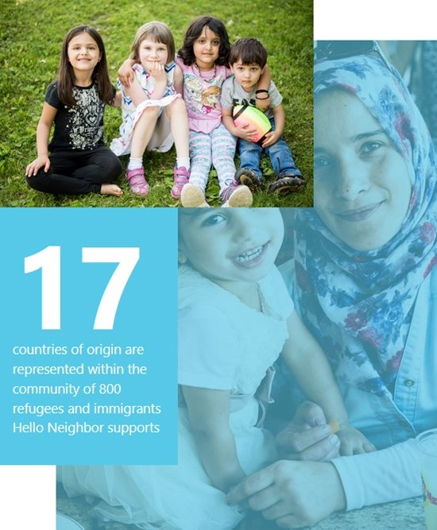
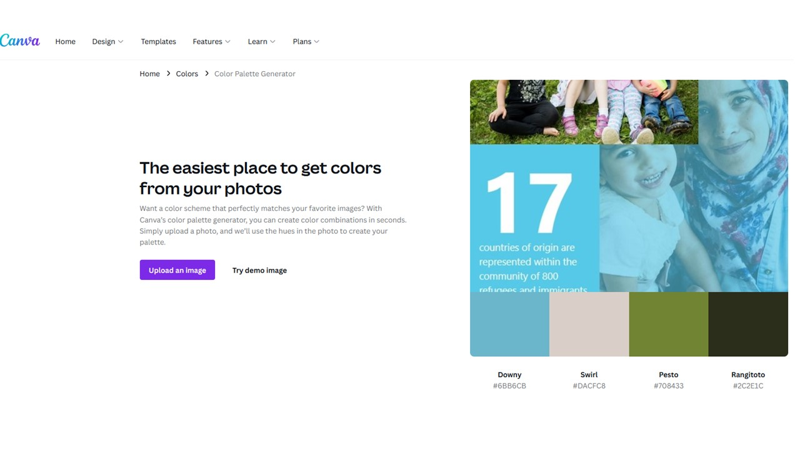

## Hello Neighbor 

I choose Hello Neighbor because my wife and I volunteer with the organization mentoring a refugee family that arrived to Pittsburgh just prior to the pandemic in 2020. We have enjoyed spending time them, learning the Afghan culture, and sharing traditions. We have taken the family to Phipps Conservatory, played board games, learned how to cook Afghan food, and spent many hours drinking tea and talking. 

__ From the "About us Page on Hello Neighbor's Website:  

### Our Mission

Hello Neighbor works to improve the lives of recently resettled refugee and immigrant families by matching them with dedicated neighbors to guide and support them in their new lives.

### Our Vision

Hello Neighbor envisions a welcoming, inclusive, and vibrant Pittsburgh and America, whose newest neighbors can realize their dreams of success and prosperity. We aspire to see communities where everyone is valued for their diverse perspectives and are empowered to rebuild their lives with dignity and respect __

[Click on Hello Neighbor Website Link to Learn More!](https://www.helloneighbor.io/about)

## Creating a Color Palette

I chose a picture from Hello Neighbor's webpage that encapsulated not on the mission of Hello Neighbor but also the central colors of the Hello Neighbor logo which are more pastel greens and blues. I also wanted a few colors like black or greys to have for background and to highlight man made features in a subtle way. 

## Hello Neighbor Map

<html>
  <head>
    <title>Hello Neighbor</title>
    <meta name="viewport" content="initial-scale=1.0, user-scalable=no">
    <meta charset="utf-8">
    
  </head>
  <body>
    

    
    
  </body>
</html>
