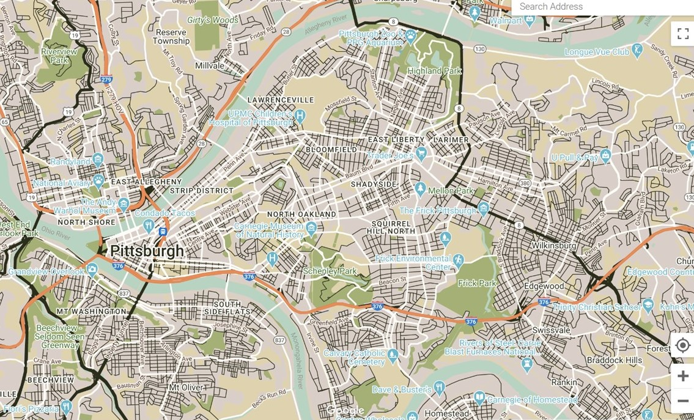

## Hello Neighbor 

I choose Hello Neighbor because my wife and I volunteer with the organization mentoring a refugee family that arrived to Pittsburgh just prior to the pandemic in 2020. We have enjoyed spending time them, learning the Afghan culture, and sharing traditions. We have taken the family to Phipps Conservatory, played board games, learned how to cook Afghan food, and spent many hours drinking tea and talking. 

*From the "About Us Page" on Hello Neighbor's Website:*  

### Our Mission

*Hello Neighbor works to improve the lives of recently resettled refugee and immigrant families by matching them with dedicated neighbors to guide and support them in their new lives.*

### Our Vision

*Hello Neighbor envisions a welcoming, inclusive, and vibrant Pittsburgh and America, whose newest neighbors can realize their dreams of success and prosperity. We aspire to see communities where everyone is valued for their diverse perspectives and are empowered to rebuild their lives with dignity and respect*

[Click on the Hello Neighbor Website Link to Learn More!](https://www.helloneighbor.io/about)

## Creating a Color Palette

I chose a picture from Hello Neighbor's webpage that encapsulated the mission of Hello Neighbor and the central colors of the Hello Neighbor logo, which are more pastel greens and blues. I also wanted a few colors like black or greys for the background and to highlight man-made features subtly. I also wanted to make sure that I connected the map to the web page through color while ensuring that the map would be user-friendly. 

Below is the color palette created by [Canva's Color Palette Generator](https://www.canva.com/colors/color-palette-generator/). It provided four different colors from the picture I took from the Hello Neighbor Website.

## Hello Neighbor Map

The map below is the final product for Hello Neighbor. I used the light green for parks and other public green spaces. The blue from the color palette was used to denote water and areas of interest to Hello Neighbor participants like museums, places of worship, and schools. The dark green was used for borders, side streets (to contrast against the white of major roads), and state highways. Finally, I used the grey from the color palette to denote manmade or built-up areas.

[View an Active Version Here](ActiveMap.html)

[Return to Home](README.md)
